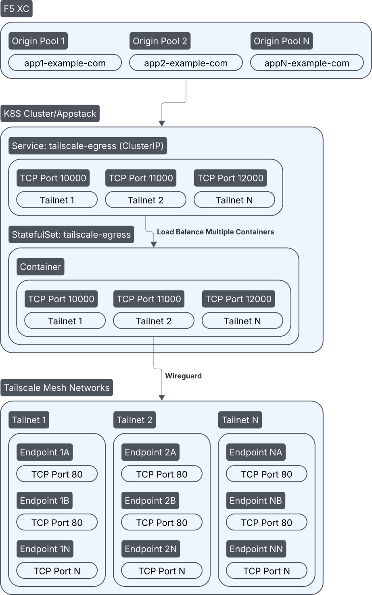

# F5 XC Tailnet Egress

A Terraform-based solution to generate manifests for connecting F5 Distributed Cloud to multiple Tailscale networks using containerized proxies.

## 🌟 Features

- **Multi-Tailnet Support**: Connect to multiple Tailscale networks simultaneously
- **Proxy-Based Routing**: High-performance L4 proxy containers with advanced traffic management
- **Kubernetes Native**: Utilise native Kubernetes objects and deployment
- **Dynamic Configuration**: Automatic port allocation and service discovery

## 🏗️ Architecture



### **🔍 Architecture Components Explained:**

#### **F5 XC Layer**

- **Origin Pools**: Define backend services for load balancing
- **Health Checks**: Monitor service availability and service monitoring
- **Traffic Distribution**: Route requests based on routing policies
- **Security Policies**: WAF, DDoS protection, and security controls
- **Global Load Balancer**: Multi-region traffic distribution
- **Analytics**: Traffic insights and monitoring

#### **Kubernetes Layer**

- **Service**: Exposes multiple ports (10000+)
- **RBAC**: ServiceAccount, Role, and RoleBinding for secure access
- **ConfigMaps**: Proxy configuration templates
- **Secrets**: Secure storage of Tailscale authentication keys
- **StatefulSet**: Main application deployment containing proxy containers
- **Proxy Container(s)**: L4 TCP proxy with tunneling support
  - **Listeners**: One per service port (10000 + tailnet_index \* 1000 + service_index)
  - **Backend Routing**: Route traffic directly to Tailscale network services
  - **Userspace Mode**: Containers capable of running in userspace mode for enhanced security and isolation

#### **Tailscale Network Services**

- **Tailscale Nodes**: Nodes can live across multiple tailnets
- **Tailscale MagicDNS**: Services accessible via Tailscale hostnames
- **Port Mapping**: Internal service ports preserved through the proxy chain
- **Protocol Support**: TCP tunneling through Tailscale mesh VPN
- **Service Examples**:
  - `app.tailnet0.ts.net:80`
  - `api.tailnet1.ts.net:3000`
  - `db.tailnet2.ts.net:5432`
  - `monitoring.tailnet3.ts.net:9090`

## 🚀 Deployment Quick Start

1.  **Clone the repository**:

    ```bash
    git clone <repository-url>
    cd f5xc-tailnet-egress
    ```

2.  **Configure your tailnets**:

    ```bash
    cp terraform.tfvars.example terraform.tfvars
    # Edit terraform.tfvars with your tailnet configurations
    ```

    #### Basic Multi-Tailnet Example

    ```hcl
    tailnets = [
      {
        tailnet_name = "tailnet0"
        tailnet_key = "tskey-auth-..."  # Tailscale authentication key
        use_k8s_secret = true           # Enable RBAC and secret management
        services = [
          {
            endpoint = "app.tailnet0.ts.net"
            protocol = "tcp"             # "tcp" or "udp"
            port = 80
            connection_timeout = 10      # Optional: connection timeout in seconds
            f5xc_origin_pool = "tailnet0-web-pool"  # F5 XC origin pool name
          }
        ]
      },
      {
        tailnet_name = "tailnet1"
        tailnet_key = "tskey-auth-..."  # Different key for tailnet1
        use_k8s_secret = true           # Enable RBAC and secret management
        services = [
          {
            endpoint = "api.tailnet1.ts.net"
            protocol = "tcp"
            port = 3000
            f5xc_origin_pool = "tailnet1-api-pool"
          }
        ]
      },
      {
        tailnet_name = "tailnet2"
        tailnet_key = "tskey-auth-..."
        use_k8s_secret = true
        services = [
          {
            endpoint = "db.tailnet2.ts.net"
            protocol = "tcp"
            port = 5432
            connection_timeout = 30      # Longer timeout for database
            f5xc_origin_pool = "tailnet2-db-pool"
          }
        ]
      },
      {
        tailnet_name = "tailnet3"
        tailnet_key = "tskey-auth-..."
        use_k8s_secret = true
        services = [
          {
            endpoint = "monitoring.tailnet3.ts.net"
            protocol = "tcp"
            port = 9090
            f5xc_origin_pool = "tailnet3-monitoring-pool"
          }
        ]
      }
    ]
    ```

3.  **Deploy the egress service**:

    ```bash
    ./deploy.sh
    ```

    #### Phase 1: Infrastructure Provisioning (Terraform)

    1. **Initialize Terraform** - Set up working directory and providers
    2. **Validate Configuration** - Verify Terraform syntax and configuration
    3. **Apply Infrastructure** - Generate all configuration files and manifests
    4. **Generate Files**:

    - Kubernetes manifests in `outputs/envoy/k8s/`
    - F5 XC origin pool JSONs in `outputs/envoy/f5xc/`
    - Configuration summary

    #### Phase 2: Application Deployment (Kubernetes + F5 XC)

    1. **Start kubectl Proxy** - Establish connection to Kubernetes cluster
    2. **Create F5 XC Origin Pools** - Deploy origin pools via F5 XC API
    3. **Apply Kubernetes Manifests** - Deploy all Kubernetes resources
    4. **Verify Deployment** - Check resource status and health

### Objects That Will Be Created

#### F5 XC Objects

- **Origin Pool** - with unique suffix names

#### Kubernetes Resources

- **Namespace**
- **ServiceAccount**
- **ConfigMap** - proxy configuration
- **Service**: - ClusterIP with neccessary ports mappings
- **StatefulSet**: main application with proxy containers

If Using Secrets,

- **Role** - RBAC permissions
- **RoleBinding** - bind role to service account
- **Secrets** - Tailscale authentication keys for each tailnet

> **Note**: The current default implementation uses Envoy proxy containers, but the architecture is designed to support other proxy solutions. You can modify the container images and configurations in the templates to use alternative proxies like socat, gost, tail4ward, or other custom solutions. The port allocation and routing logic is proxy-agnostic. More proxy configurations will be added to the project soon.

## 🔧 Port Allocations

The egress service uses a systematic port allocation scheme that works with any L4 proxy container:

- **Service Ports**: `10000 + (tailnet_index * 1000) + service_index`

Example:

- Tailnet 0: ports 10000-10999
- Tailnet 1: ports 11000-11999
- Tailnet 2: ports 12000-12999

## 🔐 Security Features

- **RBAC Integration**: Automatic ServiceAccount, Role, and RoleBinding generation
- **Secret Management**: Secure storage of Tailscale authentication keys

## 📖 Documentation

- [Envoy Solution](docs/envoy.md) - Envoy proxy implementation details

## 🛠️ Requirements

- Terraform >= 1.0
- Kubernetes cluster with RBAC enabled
- Tailscale authentication keys
- F5 Distributed Cloud access

## 🌐 Kubernetes Compatibility

These solutions are designed for can also be deployed on other standard Kubernetes distributions.

## 🏢 F5 XC Deployment Options

On F5 Distributed Cloud (F5 XC), these solutions can be deployed on:

- **Regional Edges (RE)**: For centralized, multi-region traffic management
- **Customer Edges (CE)**: For local, on-premises or edge deployments

This flexibility allows you to choose the optimal deployment model based on your network architecture and requirements.

## 🤝 Contributing

1. Fork the repository
2. Create a feature branch
3. Make your changes
4. Add tests and documentation
5. Submit a pull request

## 📄 License

This project is licensed under the MIT License. See [LICENSE.md](LICENSE.md) for full details.

## 🆘 Support

For issues and questions:

- Open an issue on GitHub
- Review the example configurations
